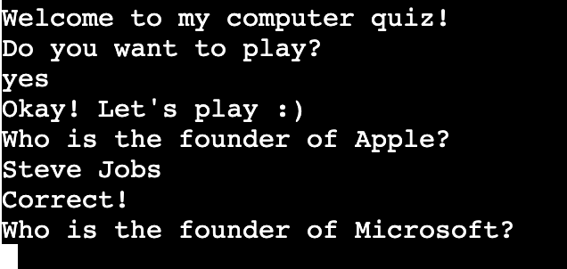
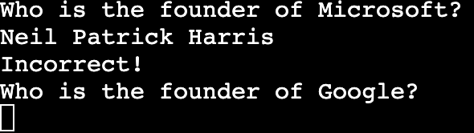
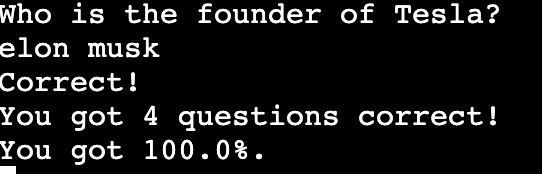

# Quiz Python Game
This is a quiz that runs in Python terminal via Heroku.

It is a simplistic quiz that consists of multiple questions, you can beat the computer by answering the questions correctly.

[Live Version Of The Game](https://quiz-game-python.herokuapp.com/)

## How to play

Quiz game consists of 5 different questions, participant has to agree to start to the quiz, which in turn will allow the computer to start posing questions, if answered correctly, you get 1 point. User's final score will also be calculated in percentage.

## Features:

 - Computer automatically asks the participant if they would like to play. 
 - If the input is yes, computer will then impose the first the questions.

 - If the questions is answered correctly, the computer will then tell you "Correct!"
 - Computer then imposes the second question.

 
 - If the question is answered incorrectly, the computer will then say "Incorrect!" and move on to the second question.

 
 - Computer then generates the score, after all the questions answered.
 - Computer calculates your score in percentages.

### Testing

- Manually tested the code, found no bugs.
- Ran the code through linter with no issues in return.

### Bugs
- No bugs were found.

### Valditor testing
- No errors were found when passing through [Pep8online](https://pep8online.com/).

### Deployment
This project was deployed through Heroku.

### Credits
- Code institute
- Udemy
- Heroku
