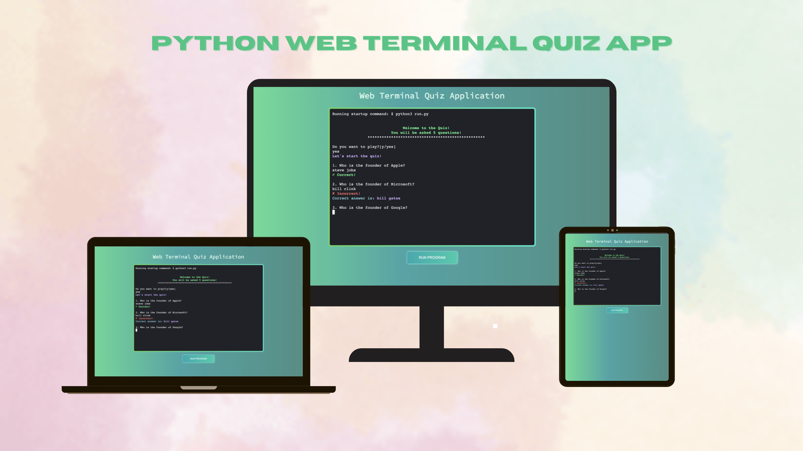
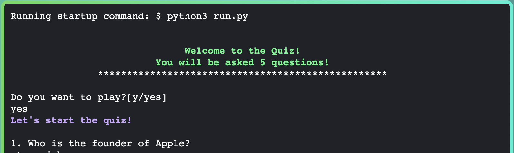
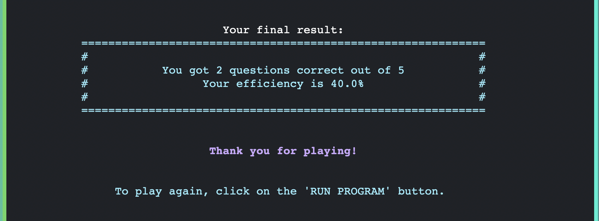
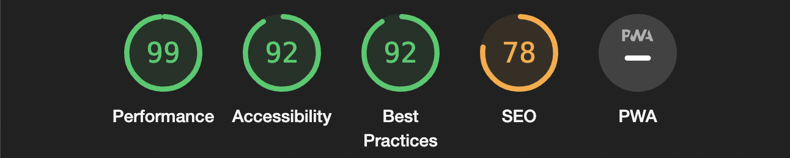

# Quiz Python Game

This is a quiz that runs in Python terminal via Heroku.

It is a simplistic quiz that consists of multiple questions, you can beat the computer by answering the questions correctly.

[Live Version Of The Game](https://quiz-game-python.herokuapp.com/)

## How to play

Quiz game consists of 5 different questions, participant has to agree to start to the quiz, which in turn will allow the computer to start posing questions, if answered correctly, you get 1 point. User's final score will also be calculated in percentage.

## Features

- Print welcome message in the terminal.
- Computer automatically asks the participant if they would like to play.
- If the input is yes, computer will then impose the first the questions.

- If the input is blank the program will prompt again with previous message/task giving a feedback.

- If the input is anything except [y|Y|yes|Yes|YES] the program will terminate giving a feedback.

- If the questions is answered correctly, the computer will then tell you "Correct!"
- Computer then imposes the second question.

 

- If the question is answered incorrectly, the computer will then say "Incorrect!" and move on to the second question.

 

- Computer then generates the score, after all the questions answered.
- Computer calculates your score in percentages.

### Technologies Used

- [Python](https://www.python.org/)
- [Javascript](https://developer.mozilla.org/en-US/docs/Web/JavaScript)
- [Heroku](https://heroku.com/)

### Testing

- Manually tested the code, found no bugs.
- Ran the code through linter with no issues in return.

### Code modifications

- Changed the questions into 1 function
- Added the questionsAsked variable
- Edited the score equation
- Created the main function
- Created lists of questions & answers
- Fixed allowance of empty data that causing program to break.
- Added custom colors module to improve output by adding color.
- Refactored code and renamed variables following PEP8 style guide.
- Added user feedback for empty input with prompting again.
- Enhanced quiz results output.
- Updated terminal UI and UX.
- Removed teminal focus after terminating the program.
- Enhanced frontend for better user experience.

### Bugs

- All bugs found were fixed, such as idententation and terminal errors.

### Valditor testing

- No errors were found when passing through [Pep8online](https://pep8online.com/).

### Deployment

- Deploying to [Heroku](https://dashboard.heroku.com/)

1. Go to your Gitpod CLI and create a requirements file by typing 'pip3 freeze --local > requirements.txt' in the root directory.
1. Next, create the Procfile by typing 'echo web: python app.py > Procfile' into the CLI root directory.
1. Open this file and type the line 'web: python3 app.py'. Make sure you delete any blank lines at the bottom, then save the file.
1. Add, commit and push your newly created files to your Github repository.
1. Then, go to [Heroku](https://www.heroku.com) and create an account.
1. After logging in, click on 'create new app'.
1. Select the closest region to your location and give the app a name.
1. Select 'GitHub' as the deployment method.
1. Within the GitHub profile, enter the name of the GitHub repository you want to deploy from and click 'search'.
1. Once Heroku has found the repository, click to connect the app.
1. Go to the 'settings' tab for the app and click 'Reveal Config Vars'.
1. Set the environment variables by entering key-value pairs (leaving out any inverted commas) so that they match those in your env.py file (see section below for further details).
1. Click 'deploy'.
1. Once deployed, your app is now runnable by clicking 'view'.

### Credits

- Code institute
- Udemy
- Heroku
